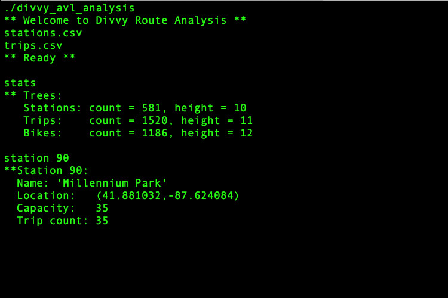
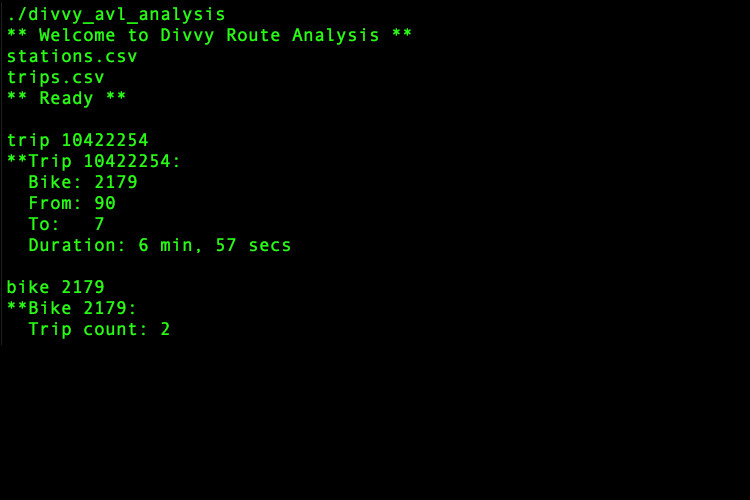

# divvy-avl-analysis
Divvy Trip Analysis Using AVL Tree

Divvy is a well-known Chicago. This program takes Divvy stations and trips data as input, and then interact with the user to support the following six commands:
1. Statistics about the AVL trees
2. Station info
3. Trip info
4. Bike info
5. Find stations nearby
6. Route analysis

The data will come from 2 input files, both in CSV format (Comma-Separated Values).This C program organize input data it into 3 AVL trees, and perform the requested analyses / output.

## User Commands:
1. stats - outputs the # of nodes, and the height, of each tree (Picture above).

2. station **_id_** - oputputs information about specified station.

3. trip **_id_** - oputputs information about specified trip.

4. bike **_id_** - oputputs information about specified bike.

These commands use AVL trees to lookup a station, trip, or bike, based on the id. If not found, output “**not found”. Examples:
For each station, output is the id, name, location in (latitude, longitude), capacity (the # of bikes that can be docked at this location), and the trip count. The trip count is the # of trips that originated, or ended, at this station. If a bike trip starts and ends at the same station, this counts as 2 trips.
For each trip, output is the trip id, the bike id for the bike that was used, the “from” station id (where the trip originated), and the “to” station id (where the trip ended). Also trip has output of the duration in minutes and seconds.
For each bike, output is the bike id, and the trip count --- the # of times the bike was used in a trip.

 5. find **_latitude_** **_longitude_** **_distance_** - finds Divvy stations that are nearby to the position entered by the user. The user inputs their latitude, longitude, and distance they are willing to ride (in miles), and the program outputs the Divvy stations whose position is <= that distance away. The stations are sorted and output by their distance from the entered position; if 2 stations are the same distance away, then those stations are in order by station id.

6. route **_tripID_** **_distance_** - performs an analysis to see how many trips are taken along a given route. The user enters a trip id, which defines a starting station **S** and a destination station **D**. The user also enters a distance, in miles.
Let **S’** be all stations that are <= distance away from **S**,
and let **D’** be all stations that are <= distance away from **D**.
Route command searches the trip data and count all trips that start from a station in **S’**, and end at a station in  **D’** . Then its computes the overall percentage this count represents, i.e. (trip count / total # of trips) * 100.

## CSV Stations file stucture:

| id | name | latitude | longitude | dpcapacity | online_date |
|---------|:---------:|:-------:|:-------:|:-------:|:-------:|
| 456 | 2112 W Peterson Ave | 41.991178 | -87.683593 | 15 | 5/12/2015 |
| 101 | 63rd St Beach | 41.78101637 | -87.57611976 | 23 | 4/20/2015 |
| ...     | ...       | ...     |...     |...     |...     |...     |

## CSV Trips file stucture:

| trip_id | starttime | stoptime | bikeid | tripduration | from_station_id | from_station_name | to_station_id | to_station_name | usertype | gender | birthyear |
|---------|:---------:|:-------:|:-------:|:-------:|:-------:|:-------:|:-------:|:-------:|:-------:|:-------:|:-------:|
| 10426648 | 6/30/2016 23:57 | 7/1/2016 0:22 | 4050 | 1466 | 259 | California Ave & ... | 123 | California Ave & ... | Subscriber | Female | 1986 |
| 10426638 | 6/30/2016 23:55 | 7/1/2016 0:40 | 4579 | 2713 | 177 | Theater on the Lake | 340 | Clark St & Wrightwood Ave| Customer | ...| ... |
| ...     | ...       | ...     |...     |...     |...     |...     |...     |...     |...     |...     |...     |